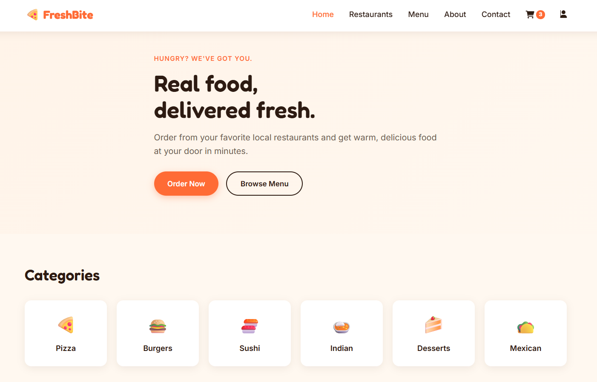
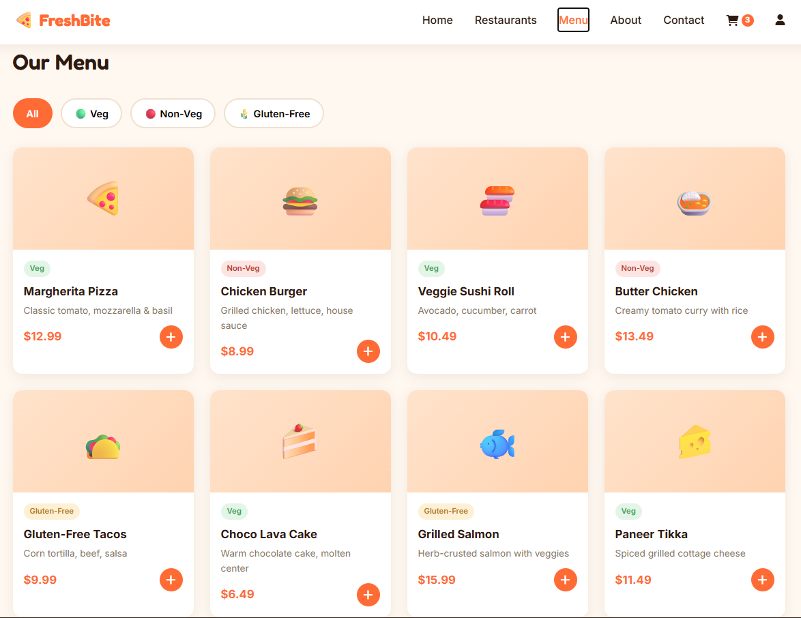

# FreshBite - Online Food Ordering Website

A frontend-only food ordering website built with HTML5, CSS3, and vanilla JavaScript, as part of a web development internship project.

## Live Preview
Open `index.html` in any browser — no server or installation needed.

## Pages Included
- **Home** – Hero banner, food categories, featured dishes, special offer
- **Restaurants** – Grid of restaurants with filters (cuisine, rating, price)
- **Menu** – Full food menu with dietary filters (Veg / Non-Veg / Gluten-Free)
- **Product Detail** – Modal popup with ingredients, calories, and add-to-cart
- **Cart** – Item list, quantity controls, subtotal/total calculation
- **Checkout** – Delivery address form, delivery time, payment method, order summary
- **Account** – Login/Register (simulated) and profile with order history, saved address, wishlist section
- **About Us** – Story, team, awards
- **Contact Us** – Location, hours, phone, contact form

## Technologies Used
- HTML5 (semantic structure)
- CSS3 (custom properties, Flexbox, Grid, media queries for responsiveness)
- Vanilla JavaScript (DOM manipulation, event delegation, localStorage)
- Font Awesome (icons) and Google Fonts (Fredoka + Inter)

## How Data Is Stored (No Database)
All data lives in JavaScript arrays/objects inside `script.js`:
- `foodItems` – all menu items
- `restaurants` – restaurant list
- `cart` – items currently in the cart
- `currentUser` / `orderHistory` – simulated login and order history

The cart, logged-in user, and order history are also saved to the browser's
`localStorage`, so they survive a page refresh (this was listed as optional
in the brief, and demonstrates a bit of extra polish).

## File Structure
```
freshbite/
├── index.html       # All pages (shown/hidden via JavaScript)
├── style.css        # All styling, organized by section
├── script.js        # All data + interactivity, organized by section
├── screenshots/     # Web-interface screenshots
└── README.md
```
## How to Run
1. Download or clone this repository
2. Open the `freshbite` folder
3. Double-click `index.html` to open it directly in your browser

   OR, for live-reload while editing:
4. Open the folder in VS Code
5. Install the "Live Server" extension
6. Right-click `index.html` → "Open with Live Server"

No installation, build step, or server setup required — this is a static
frontend-only project (HTML, CSS, JavaScript).

## Screenshots







## How the Single-Page Navigation Works
Instead of separate HTML files for every page, each "page" is a `<section class="page">`
inside `index.html`. JavaScript's `goToPage(pageId)` function hides every section and
shows only the one the user clicked on. This keeps the project simple (no routing
library needed) while still feeling like a multi-page site.

## Bonus Features Implemented
- Dietary Filters (Veg / Non-Veg / Gluten-Free)
- Delivery Time Selection
- Wishlist section (UI ready)
- Order history (simulated, saved to localStorage)
